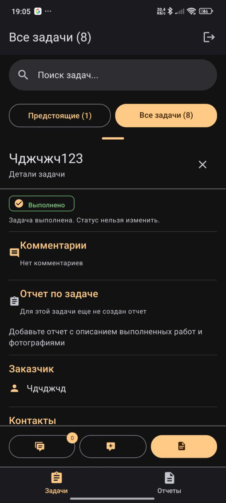
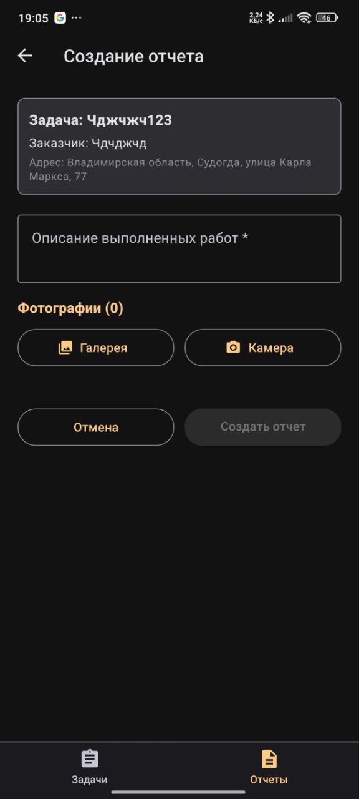

# 📊 Отчеты и аналитика

## Добавление отчета к задаче

<u>Каждой задаче можно добавить отчет о выполнении</u>:

1. **Откройте задачу** в списке, которая находится в статусе "Выполнена"
2. Нажмите кнопку **"Добавить отчет"** в нижней части экрана или можно нажать на 3 точки у элемента задачи и выбрать из списка
3. Заполните обязательные поля отчета:
   - **Описание** - подробное описание
   - **Фотографии** - визуальная фиксация этапов
4. Нажмите **"Сохранить отчет"**

## Просмотр отчета

<u>Для просмотра полной информации по отчету есть 2 способа</u>:

### 1 способ
- На вкладке с задачами **Откройте задачу** в списке, которая находится в статусе "Добавлен отчет"
- Нажмите кнопку **"Просмотреть отчет"** в нижней части экрана (при детальном просмотре задачи) или можно нажать на 3 точки у элемента задачи и выбрать из списка
- Откроется детальная страница с:
  - 📝 Информация о задаче
  - 📝 Описание выполненной работы
  - 📸 Прикрепленными фотографиями
  - 📅 Датой и временем создания

### 2 способ
- На самой вкладке можно увидеть элемент списка отчета
- Элемент представляет собой карточку с данными:
  - 📝 Информация о задаче
  - 📝 Описание выполненной работы
  - 📸 Прикрепленными фотографиями
  - 📅 Датой и временем создания

## Фильтрация отчетов по периоду

<u>Для анализа отчетов за определенный период</u>:

1. В разделе **"Отчеты"** перейти на вкладку **"По диапазону"**
2. Выберите даты:
   - **Дата начала** периода
   - **Дата окончания** периода
3. Примените фильтр

> 📈 **Важно**: Отчеты обновляются в реальном времени по мере изменения статусов задач.

**Кнопка "Создать отчет" в списке задач и в детальном просмотре:**  
 

**Форма создания отчета и фильтрация:**  
 

[Далее: Решение проблем →](/troubleshooting/README.md)